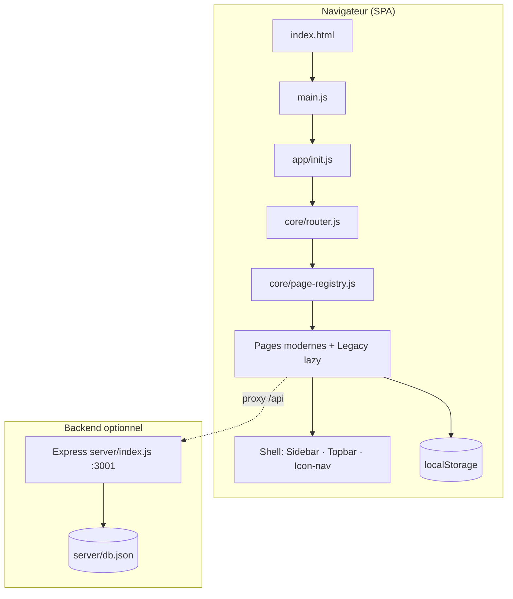
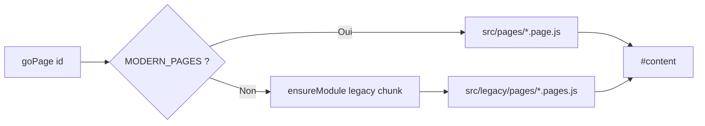
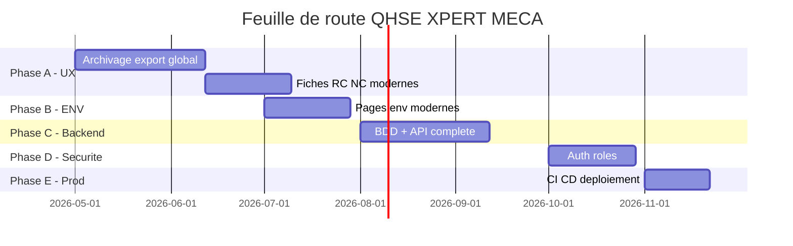

# Plateforme QHSE XPERT MECA — Résumé architecture & feuille de route

**Version document :** 1.0  
**Projet :** `qhse-platform`  
**Organisation :** XPERT MECA  
**Normes cibles :** ISO 9001 · ISO 14001 · ISO 45001  
**Date de référence :** Mai 2026  

---

## Table des matières

1. [Contexte plateforme](#1-contexte-plateforme)
2. [Périmètre fonctionnel — 8 modules QHSE](#2-périmètre-fonctionnel--8-modules-qhse)
3. [Architecture système](#3-architecture-système)
4. [Stack technique](#4-stack-technique)
5. [Structure du dépôt](#5-structure-du-dépôt)
6. [Flux applicatif & navigation](#6-flux-applicatif--navigation)
7. [Couche données & persistance](#7-couche-données--persistance)
8. [Composants transverses](#8-composants-transverses)
9. [État d'avancement par module](#9-état-davancement-par-module)
10. [Jalons réalisés (milestones)](#10-jalons-réalisés-milestones)
11. [Feuille de route — développement restant](#11-feuille-de-route--développement-restant)
12. [Workflow développeur](#12-workflow-développeur)
13. [Commandes & environnements](#13-commandes--environnements)
14. [Risques, limites & décisions d'architecture](#14-risques-limites--décisions-darchitecture)
15. [Annexes](#15-annexes)

---

## 1. Contexte plateforme

### 1.1 Vision

La plateforme QHSE XPERT MECA vise la **digitalisation du système de management intégré (SMI)** : centraliser les processus Qualité, Sécurité, Environnement et stratégie dans une interface web unique, utilisable en atelier et au bureau.

### 1.2 Problématique adressée

| Avant | Cible |
|-------|--------|
| Fichiers Excel / papier dispersés | Registres uniques par processus |
| Suivi manuel des NC, RC, audits | Workflow structuré + KPI |
| Checklists SST hétérogènes | Checklists dynamiques multi-instances |
| 5S non consolidé | Module 5S avec KPI par zone (≥ 80 %) |
| Documentation éparpillée | Module Documentation centralisé |

### 1.3 Utilisateurs cibles

- Responsable Qualité / QHSE  
- Responsables d'atelier (Usinage, Assemblage, Magasin)  
- Auditeurs internes  
- Direction (revue de direction, contexte stratégique)  

### 1.4 Point d'entrée officiel

| Fichier | Usage |
|---------|--------|
| **`index.html`** + **`npm run dev`** | Application **actuelle** (Vite, modules ES) |
| **`qhse.html`** | **Legacy** — monolithe historique (~6000 lignes), **ne plus utiliser** pour le développement |

URL de développement : **http://localhost:5173/**

---

## 2. Périmètre fonctionnel — 8 modules QHSE

| # | Module | ID technique | Norme / rôle |
|---|--------|--------------|--------------|
| 1 | Réclamations clients | `rc` | ISO 9001 — traitement réclamations, 8D, KPI |
| 2 | Non-conformités | `nc` | ISO 9001 — NC, QRQC, causes, KPI |
| 3 | Contexte & stratégie | `cst` | SMI — SWOT, PESTEL, risques, objectifs, revue de direction |
| 4 | Audits | `audit` | Audits internes, checklists, sensibilisation, présences |
| 5 | Documentation | `doc` | Registre documentaire QHSE unique |
| 6 | Audits 5S | `fives` | Lean / ordonnancement — KPI zones production |
| 7 | Sécurité SST | `sec` | ISO 45001 — risques, checklists, accidents, urgence |
| 8 | Environnement | `env` | ISO 14001 — aspects, déchets, consommations, chimiques |

**Modules transverses (hors sidebar dédiée) :** gestion des actions (par module), notifications, recherche globale, accueil KPI.

---

## 3. Architecture système

### 3.1 Vue d'ensemble



### 3.2 Pattern architectural : migration progressive

Le projet suit un modèle **« strangler fig »** :

1. **Monolithe legacy** (`src/legacy/`, `qhse.html`) — code historique extrait mais encore chargé à la demande.  
2. **Pages modernes** (`src/pages/`) — réécriture module par module, prioritaires dans `MODERN_PAGES`.  
3. **Patches** (`src/patches/`) — comportements injectés sans réécrire tout le legacy.  
4. **Données** (`src/data/`) — seeds, stores, repositories.



### 3.3 Couches logicielles

| Couche | Rôle | Emplacement |
|--------|------|-------------|
| **Présentation** | Pages, composants UI, styles | `src/pages/`, `src/components/`, `src/styles/` |
| **Application** | Router, registry, init, navigation | `src/app/`, `src/core/` |
| **Domaine** | Config checklists, zones 5S, métriques | `src/data/` |
| **Infrastructure** | Persistance, API, entity repository | `src/data/*store*`, `src/core/entity-repository.js`, `server/` |
| **Legacy** | Ancien moteur pages & helpers | `src/legacy/` |

### 3.4 Chargement lazy par module

| Module | Chunk legacy (Vite) | Pages modernes |
|--------|---------------------|----------------|
| accueil | `pages-home` | — |
| rc | `pages-rc` | liste, new, actions, kpi |
| nc | `pages-nc` | liste, new, kpi, rapport |
| audit | `pages-audit` | tb, liste, check, rapport, sensibilisation, présences, clôture |
| env | `pages-env` | aspects (+ legacy pour le reste) |
| sec | `pages-sec` | kpi, risques, checklists, instances, registre, accidents, urgence |
| cst | — (100 % moderne) | toutes pages cst-* |
| doc | — | doc-liste (réutilise audit-docs) |
| fives | — | kpi, audit, planning, checklist, liste, actions, fiche |

---

## 4. Stack technique

### 4.1 Frontend

| Technologie | Version | Usage |
|-------------|---------|--------|
| **JavaScript (ES modules)** | ES2022+ | Langage unique — pas de React/Vue |
| **Vite** | 6.x | Dev server, build, code-splitting |
| **CSS** | Modules `@import` | Design system (`variables.css`, `shell.css`, modules CSS) |
| **HTML5** | — | Shell statique dans `index.html` |

### 4.2 Backend (optionnel)

| Technologie | Version | Usage |
|-------------|---------|--------|
| **Node.js** | ≥ 18 | Runtime |
| **Express** | 5.x | API REST CRUD |
| **CORS** | — | Accès cross-origin |
| **Persistance** | `server/db.json` | Fichier JSON (prototype BDD) |

### 4.3 Qualité & outillage

| Outil | Usage |
|-------|--------|
| **Vitest** + **jsdom** | Tests unitaires (`tests/`) |
| **Scripts Node** | Extraction monolithe → modules (`scripts/`) |

### 4.4 Ce qui n'est **pas** utilisé (décision explicite)

- React, Vue, Angular  
- TypeScript  
- Prisma / PostgreSQL (roadmap)  
- Tailwind CSS  

---

## 5. Structure du dépôt

```
QHSE/
├── index.html              # Point d'entrée SPA (OFFICIEL)
├── qhse.html               # Legacy monolithe (ARCHIVE)
├── vite.config.js          # Build + proxy API
├── vitest.config.js
├── package.json
├── resume.md               # Ce document
│
├── server/
│   ├── index.js            # API Express
│   └── db.json             # Données serveur (prototype)
│
├── scripts/
│   ├── extract-monolith.mjs
│   ├── split-pages.mjs
│   └── patch-v5-helpers.mjs
│
├── tests/
│   └── entity-repository.test.js
│
├── public/                 # Assets statiques
│
└── src/
    ├── main.js             # Bootstrap
    ├── app/                # init, router patch, shell events, motion
    ├── core/               # router, page-registry, entity-repository, api-client
    ├── config/             # modules.js, navigation.js, brand.js
    ├── components/         # UI réutilisable (qhse, audit, cst, fives, shared…)
    ├── pages/              # Pages modernes par module
    ├── data/               # Seeds, stores, configs métier
    ├── patches/            # Extensions runtime (filters, modules, platform…)
    ├── legacy/             # core.js, pages/*.pages.js, helpers
    └── styles/             # CSS modulaire
```

---

## 6. Flux applicatif & navigation

### 6.1 Séquence de démarrage

```
main.js
  → initApp()
    → loadLegacy()        # core.js, patches, CRUD installers
    → installXmMotion()   # Animations, toasts
    → patchRouter()       # goHome, goModule, goPage async
    → mountSidebar()
    → goHome()
```

### 6.2 Navigation utilisateur

| Action | Fonction | Effet |
|--------|----------|--------|
| Clic sidebar | `goModule(mod)` / `goPage(id)` | Charge module + page |
| Barre icônes | `buildIconNav(mod, pageId)` | Sous-navigation module |
| Recherche | `doSearch()` | Index legacy |
| Retour accueil | `goHome()` | Tuiles modules |

### 6.3 Redirections métier (router)

| Ancienne route | Redirection |
|----------------|-------------|
| `sec-tb` | `sec-kpi` |
| `sec-docs`, `audit-docs`, `cst-docs`, `smi` | `doc-liste` |
| `env-5s` | `fives-kpi` |
| `ind` | `env-dash` |
| `reunion` | `nc-qrqc` |

---

## 7. Couche données & persistance

### 7.1 Stratégie dual-store

| Mode | Stockage | Quand |
|------|----------|-------|
| **Production actuelle** | `localStorage` navigateur | Par défaut — aucun serveur requis |
| **Prototype API** | `server/db.json` | `npm run server` + proxy Vite `/api` |

La synchronisation UI ↔ API n'est **pas encore automatique** (`src/core/api-client.js` préparé).

### 7.2 Clés localStorage principales

| Clé | Contenu |
|-----|---------|
| `xm_nc_entities` | Non-conformités (repository + soft delete) |
| `xm_rc_entities` | Réclamations clients (repository + soft delete) |
| `xm_cl_data` | Checklists SST dynamiques (instances + réponses) |
| `xm_fives_data` | Audits 5S, template checklist, actions |
| `xm_nc_projets` / `xm_rc_projets` | Référentiels projets |
| `xm_rc_clients` | Référentiel clients RC |
| `xm_nc_attachments` | Métadonnées pièces jointes NC |
| `xm_wizard_draft_*` | Brouillons formulaires wizard (sessionStorage) |

### 7.3 Entity Repository (pattern CRUD)

Fichier : `src/core/entity-repository.js`

- CRUD générique  
- **Soft delete** (`deletedAt`)  
- Filtres (statut, texte, dates)  
- Pagination  
- Utilisé par : **NC**, **RC** (extensible aux autres modules)

### 7.4 Données en mémoire (window globals legacy)

`window.RC_DATA`, `window.NC_DATA`, `window.CL_DATA`, `window.FIVES_STORE`, `window.ENV_*_DATA`, etc. — synchronisés avec localStorage par les stores modernes.

---

## 8. Composants transverses

| Composant | Fichier(s) | Fonction |
|-----------|------------|----------|
| Checklist dynamique | `components/qhse/dynamic-checklist.js` | OUI/NON/N/A, scoring, NC auto, multi-instances |
| Actions éditeur | `components/qhse/actions-editor.js` | Plans d'actions par entité |
| Filtres date hiérarchiques | `components/filters/date-hierarchy-filter.js` | NC / RC |
| Toolbar listes | `components/shared/list-toolbar.js` | Filtres, archivage, export |
| Wizard multi-étapes | `components/shared/wizard.js` | Création NC (3 étapes) |
| Export CSV / PDF | `components/shared/export-csv.js` | Téléchargement + impression |
| Platform enhancements | `patches/platform-enhancements.js` | Archivage NC/RC, pagination |
| List export registry | `patches/list-export-registry.js` | Export 5S, audits |
| Icônes SVG | `components/icons/xm-icons.js` | Icon-nav, tuiles |
| Motion / toasts | `app/xm-motion.js` | UX transitions |

---

## 9. État d'avancement par module

Légende : ✅ Opérationnel · 🟡 Partiel · 🔴 À faire / legacy dominant

| Module | Pages | CRUD | KPI | Filtres / export | Archivage | Notes |
|--------|-------|------|-----|------------------|-----------|-------|
| **Accueil** | ✅ | — | ✅ | — | — | Tuiles 8 modules |
| **RC** | 🟡 | ✅ création | ✅ | ✅ | ✅ | Fiche / 8D encore legacy |
| **NC** | 🟡 | ✅ wizard 3 étapes | ✅ | ✅ | ✅ | Fiche détail legacy |
| **CST** | ✅ | ✅ | ✅ | 🟡 | 🔴 | Module le plus complet |
| **Audit** | ✅ | ✅ | 🟡 | 🟡 export | 🔴 | Sensibilisation, présences OK |
| **Documentation** | ✅ React intégré | ✅ | ✅ | ✅ | 🔴 | Module SMI documentaire (IndexedDB) |
| **5S** | ✅ | ✅ | ✅ dashboard | ✅ CSV/PDF | 🔴 | 9 zones, checklist FR, KPI ≥ 80 % |
| **Sécurité** | 🟡 | ✅ checklists | ✅ | 🟡 | 🔴 | Multi-instances ext/phar/veh/sst |
| **Environnement** | 🟡 | 🟡 legacy | 🟡 | 🔴 | 🔴 | Aspects modernisé ; reste legacy |
| **Auth / Users** | 🔴 | — | — | — | — | Sidebar désactivée |
| **API Backend** | 🟡 | CRUD NC/RC | — | ✅ | ✅ | Non branché à 100 % sur UI |

---

## 10. Jalons réalisés (milestones)

### Phase 0 — Fondations (terminée)
- [x] Extraction monolithe `qhse.html` → structure Vite  
- [x] Shell application (topbar, sidebar, icon-nav, content)  
- [x] Router async + lazy loading chunks  
- [x] Système icônes SVG & branding XPERT MECA  

### Phase 1 — Modules cœur qualité (terminée partiellement)
- [x] RC / NC — listes modernes, filtres date, KPI dashboards  
- [x] Création NC (formulaire + wizard + pièces jointes)  
- [x] Création RC (formulaire)  
- [x] Entity repository + archivage NC/RC  
- [x] Export CSV / PDF listes NC/RC  

### Phase 2 — SMI & audits (terminée partiellement)
- [x] Module Contexte & Stratégie (CST) complet  
- [x] Module Audits (liste, planning, checklist, sensibilisation)  
- [x] Module Documentation séparé (ex-« docs » dispersés)  

### Phase 3 — SST & checklists (terminée partiellement)
- [x] Checklists dynamiques avec persistance `xm_cl_data`  
- [x] Multi-instances (extincteurs, pharmacie, véhicules, machines SST)  
- [x] Registre global checklists  
- [x] Retrait navigation EPI dédiée (via checklists)  
- [x] Risques, accidents, urgence, KPI sécurité  

### Phase 4 — 5S & environnement (en cours)
- [x] Module 5S autonome (`fives`)  
- [x] 9 zones production, checklist standard FR (28 critères)  
- [x] KPI Conforme / Non-conforme, objectif 80 %  
- [x] Audits bi-hebdomadaires, planning, plans d'actions  
- [x] Tableau de bord type Power BI (donut, barres, suivi)  
- [x] Redirection `env-5s` → module 5S  
- [ ] Modernisation complète pages ENV (déchets, conso, chimiques…)  

### Phase 5 — Plateforme transverse (en cours)
- [x] Couche platform-enhancements (NC/RC)  
- [x] Export générique 5S / audits  
- [x] API Express prototype + proxy Vite  
- [x] Tests Vitest entity-repository  
- [ ] Sync bidirectionnelle UI ↔ API  
- [ ] Extension archivage à tous les modules  

---

## 11. Feuille de route — développement restant

### Phase A — Consolidation UX (priorité haute) — *4 à 6 semaines*

| Tâche | Livrable | Module |
|-------|----------|--------|
| A1 | Étendre archivage + pagination + export | sec, env, audit, doc |
| A2 | Wizard création RC (comme NC) | rc |
| A3 | Moderniser fiches RC/NC (8D, traitement) | rc, nc |
| A4 | Harmoniser boutons CRUD partout | tous |
| A5 | États chargement / validation formulaires | tous |

### Phase B — Environnement & conformité — *3 à 4 semaines*

| Tâche | Livrable |
|-------|----------|
| B1 | Pages ENV modernes (déchets, conso, chimiques, urgences) |
| B2 | KPI environnement unifié |
| B3 | Lien aspects → actions correctives |

### Phase C — Backend & persistance réelle — *4 à 6 semaines*

| Tâche | Livrable |
|-------|----------|
| C1 | PostgreSQL ou SQLite + migrations |
| C2 | API REST complète (8 modules) |
| C3 | Sync client : TanStack Query ou service layer |
| C4 | Seeder données réalistes |
| C5 | Sauvegarde / restauration |

### Phase D — Gouvernance & sécurité — *3 à 4 semaines*

| Tâche | Livrable |
|-------|----------|
| D1 | Authentification (JWT / SSO) |
| D2 | Rôles & permissions par module |
| D3 | Journal d'audit (qui a modifié quoi) |
| D4 | Module Utilisateurs & Paramètres |

### Phase E — Industrialisation — *2 à 3 semaines*

| Tâche | Livrable |
|-------|----------|
| E1 | CI/CD (build, tests, deploy) |
| E2 | Documentation utilisateur |
| E3 | Tests E2E critiques |
| E4 | Retrait définitif legacy (`qhse.html`, chunks obsolètes) |
| E5 | PWA / mode offline atelier |

### Diagramme roadmap



---

## 12. Workflow développeur

### 12.1 Ajouter une nouvelle page

1. Créer `src/pages/{module}/{module}-{nom}.page.js`  
   - Exporter `renderXxx()` (+ `bindXxx()` si événements).  
2. Enregistrer dans `src/core/page-registry.js` → `MODERN_PAGES`.  
3. Ajouter entrée sidebar dans `src/config/navigation.js`.  
4. Ajouter icône dans `src/config/modules.js` + `src/patches/icons-global.js`.  
5. Ajouter titre dans patch module ou `icons-global.js` (`CLEAN_TITLES`).  
6. Si filtres spécifiques : brancher dans `src/app/content-nav.js`.  
7. Vérifier : `npm run build` + test manuel `npm run dev`.

### 12.2 Modifier une checklist SST

1. Config template : `src/data/sec-checklist-configs.js`  
2. Multi-instance : `src/data/sec-checklist-instances.js`  
3. Rendu : `src/components/qhse/dynamic-checklist.js`  
4. Persistance : clé `xm_cl_data`

### 12.3 Ajouter persistance avec archivage

1. Seed : `src/data/{module}.seed.js`  
2. Repository : `src/data/{module}-repository.js` via `createEntityRepository()`  
3. Filtres : patch `{module}-filter.js`  
4. Enregistrer export dans `patches/list-export-registry.js`

### 12.4 Règles de contribution

- **Ne pas** développer sur `qhse.html` — uniquement `src/`.  
- **Minimiser** les changements legacy sauf correction bloquante.  
- **Préférer** pages modernes + patches plutôt qu'extension monolithe.  
- **Tester** : `npm run build` avant commit.  
- **Français** pour tous les libellés UI.

---

## 13. Commandes & environnements

### 13.1 Installation

```bash
cd QHSE
npm install
```

### 13.2 Développement

```bash
# Terminal 1 — Interface (obligatoire)
npm run dev
# → http://localhost:5173/

# Terminal 2 — API (optionnel)
npm run server
# → http://localhost:3001/api/health
```

### 13.3 Build & tests

```bash
npm run build      # Production → dist/
npm run preview    # Preview build
npm run test       # Vitest
npm run test:watch
```

### 13.4 Mode plateforme vide (sans données démo)

Pour évaluer l’avancement module par module **sans jeux de données préremplis** :

| Méthode | Usage |
|---------|--------|
| **URL** | Ouvrir `http://localhost:5173/?empty=1` — vide le `localStorage` QHSE et active le mode vide |
| **Variable d’environnement** | Créer `.env` avec `VITE_EMPTY_DATA=true`, puis `npm run dev` |
| **Console navigateur** | `resetQhseToEmpty()` — efface les données et recharge |
| **Désactiver** | `localStorage.removeItem('xm_empty_platform')` puis recharger (les seeds démo reviennent au prochain accès si le stockage est vide) |

Clés effacées : `xm_nc_entities`, `xm_rc_entities`, `xm_cl_data`, `xm_fives_data`, `xm_nc_projets`, `xm_nc_project_meta`, `xm_rc_trimestre_meta`, `xm_rc_projets`, `xm_sec_epi_*`, `xm_rc_clients`, `xm_nc_attachments`, plus les brouillons wizard `xm_wizard_draft_*` en session.

### 13.5 Maintenance legacy

```bash
npm run extract    # Regénère legacy depuis monolithe (si qhse.html modifié)
npm run split-pages
```

### 13.5 Variables & ports

| Service | Port | Config |
|---------|------|--------|
| Vite dev | 5173 | `vite.config.js` |
| API Express | 3001 | `server/index.js` |
| Proxy API | `/api` → 3001 | `vite.config.js` `server.proxy` |

---

## 14. Risques, limites & décisions d'architecture

| Risque | Impact | Mitigation roadmap |
|--------|--------|-------------------|
| Données dans localStorage | Perte si cache effacé | Phase C — BDD serveur |
| Double code legacy / moderne | Maintenance coûteuse | Migration progressive, Phase E retrait legacy |
| Pas d'authentification | Usage non multi-utilisateur | Phase D |
| API non synchronisée UI | Deux sources de vérité | Phase C3 sync layer |
| `qhse.html` encore présent | Confusion utilisateurs | Documentation + suppression Phase E |
| Tests limités | Régressions | Étendre Vitest + E2E Phase E |

### Décisions actées

1. **Vanilla JS** conservé — pas de refonte React (coût / délai).  
2. **localStorage** comme store primaire — déploiement sans infra.  
3. **Module Documentation** extrait — un seul registre `doc-liste`.  
4. **Module 5S** séparé de l'environnement — KPI métier distinct.  
5. **Checklists SST** — standard dynamique, EPI retiré de la barre icônes.

---

## 15. Annexes

### 15.1 Zones 5S (production)

| Groupe | Zones |
|--------|-------|
| Usinage | Usinage CNC, Débitage (Usinage) |
| Assemblage | Assemblage Machine 1 & 2, Débitage (Assemblage), Contrôle réception, Câblage électrique |
| Magasin | Zone A, B, C |

**KPI zone** = % Conforme sur checklist standard (objectif **≥ 80 %**).  
**Fréquence audit** = toutes les **14 jours** par zone.

### 15.2 Checklists SST multi-instances

| Template | Code | Instances |
|----------|------|-----------|
| Extincteurs | `ext` | 1 checklist / extincteur |
| Pharmacie | `phar` | 1 / armoire |
| Véhicules | `veh` | 1 / véhicule |
| Machines SST | `sst` | 1 / machine |

Registre global : page `sec-cl-registre` — clé `xm_cl_data`.

### 15.3 Fichiers de configuration clés

| Fichier | Rôle |
|---------|------|
| `src/config/modules.js` | IDs modules + icon-nav |
| `src/config/navigation.js` | Sidebar structure |
| `src/core/page-registry.js` | Registre pages modernes |
| `src/core/router.js` | Navigation + redirections |
| `src/data/sec-checklist-configs.js` | Templates checklists SST |

### 15.4 Contacts & maintenance document

| Élément | Valeur |
|---------|--------|
| Projet npm | `qhse-platform` v1.0.0 |
| Marque | XPERT MECA — Plateforme QHSE |
| Mise à jour doc | À réviser à chaque phase roadmap |

---

*Document généré pour accompagner la finalisation professionnelle du SMI digital XPERT MECA. Toute évolution majeure d'architecture doit être reflétée dans ce fichier.*
